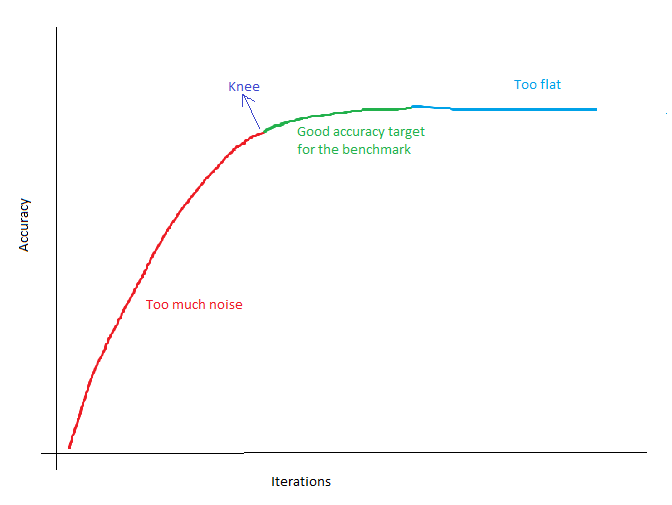
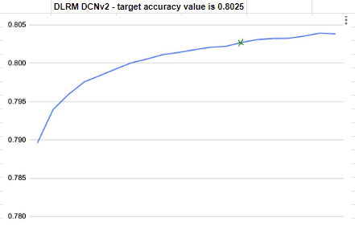

## Contributing

The best way to contribute to the MLCommons is to get involved with one of our many project communities. You find more information about getting involved with MLCommons [here](https://mlcommons.org/en/get-involved/#getting-started). 

Generally we encourage people to become a MLCommons member if they wish to contribute to MLCommons projects, but outside pull requests are very welcome too.

To get started contributing code, you or your organization needs to sign the MLCommons CLA found at the [MLC policies page](https://mlcommons.org/en/policies/). Once you or your organization has signed the corporate CLA, please fill out this [CLA sign up form](https://forms.gle/Ew1KkBVpyeJDuRw67) form to get your specific GitHub handle authorized so that you can start contributing code under the proper license.

MLCommons project work is tracked with issue trackers and pull requests. Modify the project in your own fork and issue a pull request once you want other developers to take a look at what you have done and discuss the proposed changes. Ensure that cla-bot and other checks pass for your Pull requests.

## Requirements for an MLPerf Training reference

 ### General

 1. Reference repository code must run without error on reference hardware (1xV100) on day of benchmark reference freeze. Exception: large language model code must run on (64xA100s) as it does not fit on (1xV100).
 
     a. The Reference Platform(s) will be reviewed and updated as part of the MLPerf benchmark roadmapping process.

 2. Compute must be done in full fp32 precision for any math.

 3. Max runtime is 7 days on 1x V100, fp32.

     a. An exception from the 7-day @ 1 GPU rule can only come from the Submitter's Working Group.

 4. Implementation should be minimalistic.

     a. Remove redundant files and features not relevant to the reference

     b. Minimal set of dependencies

     c. Avoid not obvious or hacky solutions (e.g. monkey patching), code should be easy to read
     and straightforward

 5. Command-line arguments:

     a. There must be a command line parameter for every tunable hyperparameter.

     b. Constraints on tunable hyperparameters must be reflected in command line parameter setup (e.g. hyperparameters that must be integers take only integer command line args, not floats) to minimize risk of accidentally running an illegal config.

     c. There may be command line params for non-tunable parameters, but those parameters must be set to the correct default value when not set with the command line.

     d. Hyperparameters may also come from a JSON file, but command line settings take precedent over the file, or a warning could be raised.

 6. This document applies to ***new*** references, in v1.0 and after.  Existing references from v0.7 and earlier should try to adhere as well, but are not required to.

     a. For example, Mini-Go was a v0.7 benchmark so it does not need to adhere to the new gradient accumulation requirement.

 ### Hyperparameters & thresholds:

 1. There must be an explicit list of hyperparameters which can be tuned by submitters, along with tuning rules (e.g. "any positive integer", "grid of allowed values", "one of a few choices" etc.), and allowed optimizers (if more than one).   This should show up in the README and [MLPerf rules doc](https://github.com/mlcommons/training_policies/blob/master/training_rules.adoc#hyperparameters "hyperparameter rules").

 2. The target accuracy threshold needs to be explicit in the README and [MLPerf rules doc](https://github.com/mlcommons/training_policies/blob/master/training_rules.adoc#benchmarks "benchmark table").

 ### Environment

 1. The code must be in a docker container, based on the official upstream docker container.

     a. Use the latest public upstream container if you are preparing a new reference model.

 2. All dependencies must be frozen, with version specified in requirements.txt or in the Dockerfile.

 3. Proposal: reference docker image could be uploaded to dockerhub (under mlperf account) to improve reproducibility.

 ### Implementation features

 1. MLPerf-compliant RNG seeding must adhere to [RNG rules](https://github.com/mlperf/training_policies/blob/master/training_rules.adoc#51-random-numbers "training rules doc").

 2. Gradient Accumulation (to emulate large batch training on a few GPUs)

     a. Basic experiments must be performed to verify that gradient accumulation closely emulates large-batch training.

     b. Benchmarks that were established before v1.0, such as Mini-Go, are exempt from this.

 3. Support for single-node multi-GPU training is optional, but encouraged.

     a. Each GPU should get its own process (to reduce overheads) and data parallel is preferred over model parallel (or other techniques).

     b. The reference may support multi-gpu validation, but this step needs to be implemented carefully (e.g. batch norm statistics should be all-reduced across workers to make sure that all replicas are evaluating the same model).

 4. Support for MLPerf logging is required.

     a. Initial support, at least, must be ready by reference freeze time.  The final list of logged hyperparameters depends on what would be modifiable by submitters.

     b. When the final list of tunable hyperparameters is ready, the final implementation of reference MLPerf logging must be made available.  This likely also require changes to the compliance checker to enforce legal values of hyperparameters.

 5. Execution should be deterministic if possible, following rules established in the [convergence document](https://docs.google.com/document/d/15DBV5mM8KHYMjGRsJiztQaz-uxKaekOr2pnwmQl_RT0/edit#heading=h.m94pu2k61l60 "google doc").

 6. Support for multi-node training is optional, but encouraged.  This support does not have to be documented in the public README.

 7. Support for mixed precision training w/ [AMP](https://developer.nvidia.com/automatic-mixed-precision) is optional, but encouraged.

 ### Data

 1. Justification for setting target accuracy must be provided.

     a. Training to target must be reasonably stable.  Many random seeds should reach the target with similar number of steps/epochs

     b. Target should be as close to state-of-the-art as possible

 2. Given a proposed target accuracy on a few (around 10 - 100) random seeds, all seeds must reach target accuracy. Steps-to-convergence variance should be as low as possible

 3. Convergence curves as specified by [Bounded Convergence Document](https://docs.google.com/document/d/15DBV5mM8KHYMjGRsJiztQaz-uxKaekOr2pnwmQl_RT0/edit#heading=h.m94pu2k61l60 "google doc") must be reviewed by the Submitter's Working Group.

 4. Any datasets or checkpoints needed to run the benchmark must be provided so others can run the reference for the life of that benchmark until it is retired, plus 1 year after the last usage.

 ### Scripts

 1. `run_and_time.sh` script - to execute the benchmark

 2. `download_dataset.sh` script - to download dataset and do the initial data preprocessing

 3. `verify_dataset.sh` script - to verify correctness of preprocessed data, usually checks md5 sums

 4. if training starts from pretrained checkpoint (or backbone):

     a. script to download pretrained checkpoint (or backbone)

     b. scripts to convert pretrained checkpoint (or backbone) to other popular frameworks must be available

 ### README

 1. brief description of problem, requirements, environment, preprocessing steps, training data, model, optimizer and target metric (description of the metric, target value, evaluation frequency, size of eval dataset).  See [this](https://github.com/mlcommons/training_policies/blob/master/training_rules.adoc#benchmarks) section from the rules

 2. Three summaries are expected.  
     a. Section 1, Summary, of the readme should be a very high level description of the task, for a reader with zero background of machine learning.  

     b. Following the high level description in section 1 should be a description for technical press, who have some machine learning context, so would be interested in more details.  

     c. Section 4, Model, should describe the problem to a machine learning practitioner, and also include a link to the paper describing that network.

### Target Accuracy

 1. All reference benchmarks are expected to take 7-day @ 1 GPU to run, thus the target accuracy should be chosen such that the benchmark fits in that time frame. Some references like gpt3/stable diffusion take much longer, but these are rare excpetions
 2. The goal is to choose an accuracy target with low variance on the probability distribution of number of iterations. To get this, run as many runs as possible and plot accuracy vs iteration plots. Target accuracy should be picked from the region right after the knee point in the accuracy curve
     

     a. Too flat region - The reason the ""too flat"" region is ""too flat"" is because when you try to pick an accuracy by drawing a horizontal line at that accuracy, the angle the line intersects with the plot is very low. Which means the iterations needed to get that accuracy has a very high range (In numerical analysis this is called ""ill conditioned""). Thus, it would not make a good benchmark accuracy target

     b. Too much noise region - the model starts improving very quickly in this region, so the accuracy change for a small delta in iterations is very high. Thus, the accuracy in this region is not stable for a benchmark target
 3. Some examples for target accuracy from the DLRM and GPT3 benchmarks are shown below
     
     